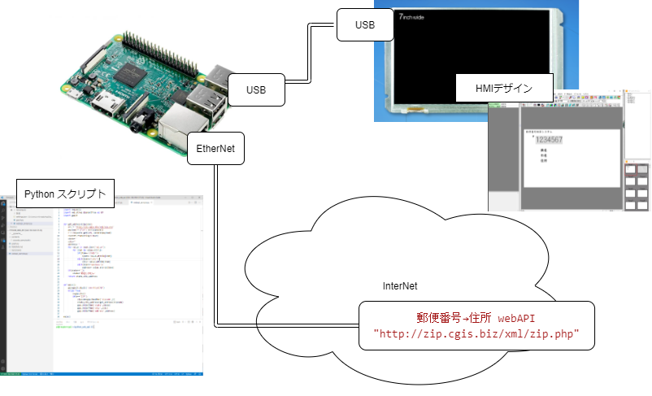
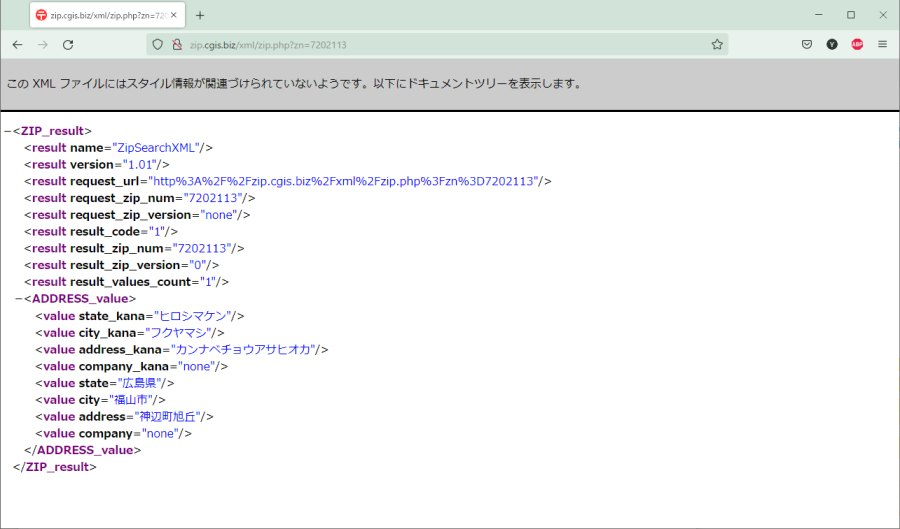
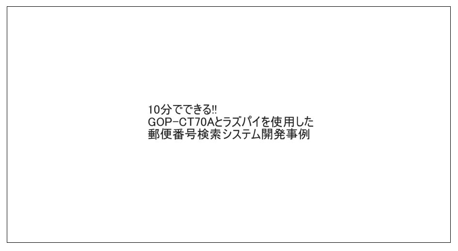

# 10分でできる!!GOP-CT70Aとラズパイを使用した郵便番号検索システム開発事例
## 概要
ホストにraspberrypiなどのlinuxが動作するボードコンピューター(SBC)を使用すると  
Pythonを使用してwebAPI連携したシステムが簡単に構築できます。  
  

今回はサンプルとして郵便番号を引数として与えると住所を返すwebAPI(http://zip.cgis.biz/xml/zip.php)を  
利用し、GOP-CT70Aで郵便番号を入力すると住所情報を応答します。  
  

このサンプルの開発手順は以下動画にまとめています。  
画像をクリックするとYoutubeで動画が再生します。  
[](https://www.youtube.com/watch?v=PWhwNwIdhRE&ab_channel=GOPChannel)
 


## サンプルの説明

画面の設計については動画の手順を参考にしてください。  
画面のデータは [contents/zipcode_sample.etlx](contents/zipcode_sample.etlx)においていますのでダウンロードしTP-DesignerLTで開くことができます。  

ラズパイ側のコードは以下のようになります。  

外部ライブラリの読み込み
```python
import requests                     #HTTPを処理するための
import xml.etree.ElementTree as ET  #応答で返ってくるxmlを解析するため
import goplt                        #GOP-LT/CTシリーズのコマンド通信処理のため
```
郵便番号から住所を取得するための関数
```python
def get_address(zipcode):
    url = "http://zip.cgis.biz/xml/zip.php" #webAPIのURLを指定
    payload = {"zn": str(zipcode)}          #パラメーター'zn'に任意の番号を文字列化してセット
    r = requests.get(url, params=payload)   #HTTP GETメソッドを実行し応答をrに格納
    root=ET.fromstring(r.text)              #応答分を解析のためxmlパーサーにセット
    state=''                                #戻り値の初期化
    city=''
    address=''
    for value in root.iter('value'):        #応答から要素を検索し、state(県名),city(市名),address(住所)に一致する要素の値を戻り値用変数にセットします。
        for item in value.attrib:
            if(item=='state'):
                state= value.attrib[item]
            elif(item=='city'):
                city= value.attrib[item]
            elif(item=='address'):
                address= value.attrib[item]
    if(state==''):
        state='存在しません'                #応答に住所情報がない場合'存在しません'をセット

    return state,city,address              #戻り値を返します

```
メイン
```python
def main():
    gop=goplt.Goplt('/dev/ttyACM0')        #GOP-LT/CT通信用クラスのインスタンスを生成します。通信に使用するデバイス名を引数として与えます。
    while True:                            #メインループ 
        s=gop.Enq()                        #GOP-CT70Aからの出力電文を確認します。画面の設計で入力処理が完了していると'ZIP'が出力されます。
        if(s=='ZIP'):
            zipcode=gop.ReadMem('zipcode',1)        #テンキーで入力した郵便番号を読みだします。
            state,city,address=get_address(zipcode) #郵便番号から県、市、住所を取得します
            gop.WriteTMem('state',state)            #取得した内容をGOP-CT70Aのテキストメモリに書き込みます
            gop.WriteTMem('city',city)
            gop.WriteTMem('address',address)
                
main()                                      #main()の開始
    
```

## 最後に
ラズパイ等Linuxが動作するボード上でPythonでアプリケーションを作成することで簡単にデータ処理などのロジックを記述できますが  
その表示のためのユーザーインターフェースを作成しようとするとそれなりの作業量があります。  
CUIベースであれば数行で済む内容が、GUIベースでアプリケーションを作成しようとするとその数倍のコードが必要になります。  
見栄えをよくしようとすれば、商用ツールキットの利用も必要になるかもしれません。  
GOP-CT70Aを使用してシステムを作成する場合、今回のサンプルのように  
* ユーザーインターフェースはTP-DesignerLTを使用して、お絵かき感覚でコードを記述せずに作成可能  
* システムのコードもCUIアプリケーションなみの記述でOK  
というメリットがあります。

製品の試作や開発期間の短縮などGOP-CT70Aを利用したシステム開発にご興味いただければ  
[こちら](https://www.ishiihyoki.co.jp/download/user/)よりユーザー登録をお願いいたします。
